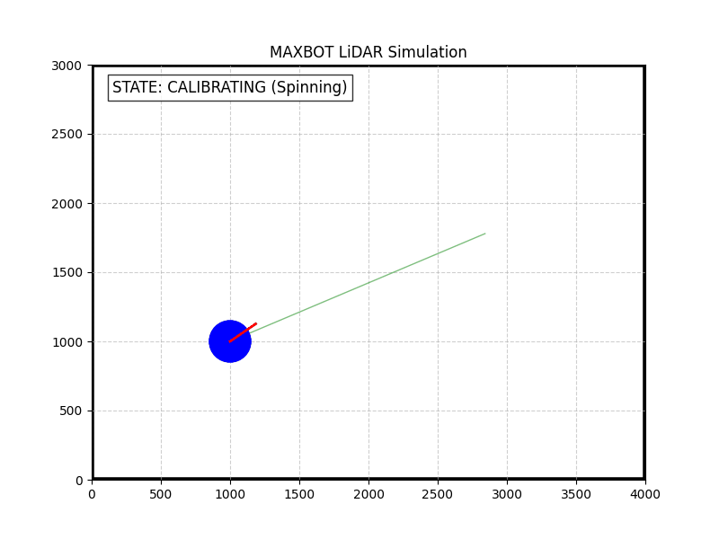
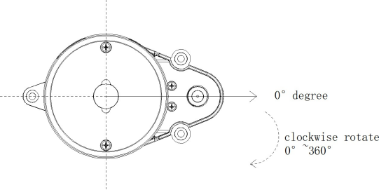
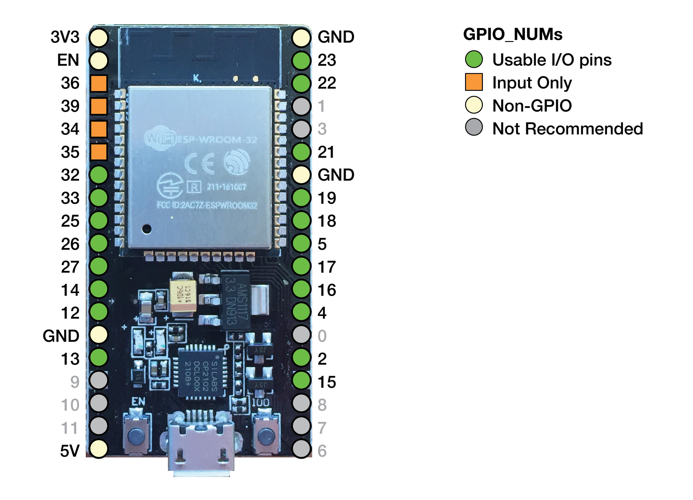

# RUHART MAX-ROBOT

> *Designed by RU HART Software team*

> *Special thanks to RU HART Electrical team and others*

This repository contains the embedded C++ firmware for an ESP32-based wall following robot. The system utilizes an LD20 (LD14P protocol) LiDAR module to perform autonomous room navigation, dynamic corner-finding, automatic motor calibration, and collision evasion without relying on wheel encoders, IMU sensors, or physical bump sensors.

All code is written to follow the RU-HART programming standard. 

---

## Simulation Example GIF
**MAX-BOT SIMULATION:** 

Simulation generated in Python to demonstrate functionality of MAX-BOT navigation. The robot starts in ``CALIBRATING`` state then moves to ``FINDING CORNER`` then to ``NAVIGATING TO CORNER`` then to ``WANDER``. These states are finate to ensure the robot is always in exactly 1 defined state. 

## Hardware Used

* **Microcontroller:** ESP32 Development Board
* **LiDAR:** Youyeetoo LD20
* **Motor Driver:** Unknown to developer (Apollo)

---

## 1. Physical Assembly and Alignment

Proper hardware calibration is mandatory. The software relies on the physical orientation of the sensor to map the environment accurately.

### 1.1 Forward Vector Alignment
The LD20 LiDAR module has a designated "front" (the 0° mark of the LiDAR module). 
* **Crucial Step:** The 0° axis of the LiDAR **must** point directly forward, perfectly parallel to the tracks of the tank chassis. 
* The 90° axis represents the strict right side.
* The 270° axis represents the strict left side.

If the sensor is rotated, the internal 60° forward-collision cone (spanning 330° to 30°) will trigger off-axis, causing the robot to crash into forward obstacles which could damage the robot.

### 1.2 Wiring and Pin Configuration
Wire your components according to the following mapping. Ensure a common ground is shared across the ESP32, the LiDAR, and the Motor Driver.

| Component | Signal | ESP32 Pin | Description |
| :--- | :--- | :--- | :--- |
| **LiDAR LD20** | TX | GPIO 1 | Transmits LiDAR data to ESP32 RX |
| **LiDAR LD20** | RX | GPIO 3 | Receives commands from ESP32 TX |
| **LiDAR LD20** | PWM | GPIO 13 | Controls LiDAR motor spin rate |
| **LiDAR LD20** | EN | GPIO 14 | Enables/Disables LiDAR motor |
| **Motor Driver** | Left PWM/DIR | GPIO 25 | Controls Left Track |
| **Motor Driver** | Right PWM/DIR| GPIO 26 | Controls Right Track |

---

## 2. Software Installation & Setup

1.  **Install the Arduino IDE:** Ensure you have the latest Arduino IDE installed with the ESP32 board manager configured.
2.  **Install Dependencies:** This project requires the Kaia.ai LiDAR library. Open the Arduino Library Manager and install `lds_all_models`.
3.  **Clone Repo:** Download the code by running ``git clone https://github.com/RU-HART/RUHART_Robot`` and copying ``main.cpp`` into the sketch open in Arduino IDE.
4.  **Motor Driver Customization:**  Open the new `main.cpp`.
    * Locate the `setMotors(uint8_t left_pwm, uint8_t right_pwm)` function.
    * **WARNING**: The current motor driver as of release v1.0.0 ASSUMES SINGLE PIN MOTOR DRIVER! THIS *WILL* FAIL IN PRODUCTION!
5.  **Flash the Firmware:** Connect your ESP32 via USB and upload the code. Monitor the output at `115200` baud.

---

## 3. Operational Logic & System Architecture

### 3.1 Memory Management
As per RU HART programming standards, there are no memory allocations during operation. In order to handle incoming LiDAR data, we preallocate an array of LiDAR states in the ``INITALIZATION`` stage. Incoming LiDAR data is mapped to a statically allocated global array: `uint16_t scan_data[360]`.

### 3.2 The Finite State Machine (FSM)
The robot's behavior is governed by a 4-stage FSM evaluated only when a complete 360° LiDAR sweep is registered. To see states, refer to the simulation section.

1.  **Calibration (`STATE_CALIBRATE_TURN`):** Because the system lacks wheel encoders, it uses the room's LiDAR as a localization reference frame. It locks onto the closest static object, spins in place at 20% power, and tracks how long it takes for the object to complete a 360° shift in the LiDAR array. It does this three times and calculates a turn-rate baseline and turn radius using:
    $$Time_{avg} = \frac{1}{3} \sum_{i=1}^{3} T_{360_i}$$
    $$R = \left| \frac{\Delta r \cdot r}{\Delta r \sin(\theta) + r \Delta \theta \cos(\theta)} \right|$$
2.  **Corner Acquisition (`STATE_FIND_CORNER`):** The robot parses the 360° array to find a local maximum distance flanked by closer distances (a geometric corner). It calculates the required turn duration based on $Time_{avg}$ and rotates to face it.
3.  **Navigation (`STATE_NAVIGATE_CORNER`):** The robot executes the timed turn blindly, relying on the calibrated baseline.
4.  **Wander & Evade (`STATE_WANDER`):** The robot drives forward. If any object breaches the 300mm collision threshold within the front 60° cone, it halts, recalculates a 90° evasion turn using the $Time_{avg}$ baseline, and resumes operation.

## A word to all of our collaborators

RU HART would like to thank you for supporting our club with your time and interest. Your devotion to helping us build a brighter future for food security does not go unnoticed. We thank you for your diligent hard work.